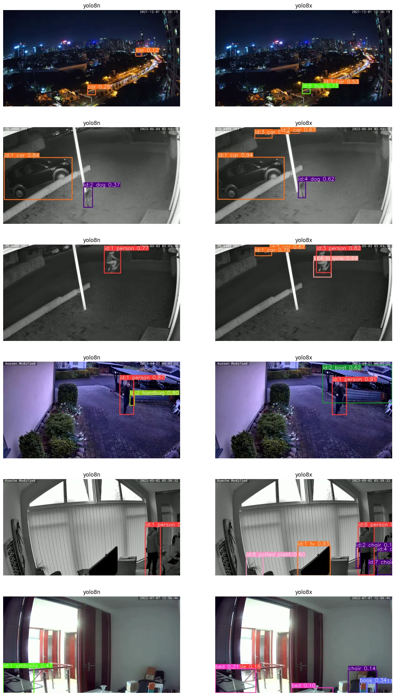

# YOLOv8 Object Tracking

## Comparing the YOLOv8 Models

|  Model  |  Type  |  Weights  |
| -- | -- | -- |
| YOLOv8 | Detection | yolov8n.pt, yolov8s.pt, yolov8m.pt, yolov8l.pt, yolov8x.pt |
| YOLOv8-seg | Instance Segmentation | yolov8n-seg.pt, yolov8s-seg.pt, yolov8m-seg.pt, yolov8l-seg.pt, yolov8x-seg.pt |
| YOLOv8-pose | Pose/Keypoints | yolov8n-pose.pt, yolov8s-pose.pt, yolov8m-pose.pt, yolov8l-pose.pt, yolov8x-pose.pt, yolov8x-pose-p6.pt |
| YOLOv8-cls | Classification | yolov8n-cls.pt, yolov8s-cls.pt, yolov8m-cls.pt, yolov8l-cls.pt, yolov8x-cls.pt |


### Object Detection

```bash
.
├── main.py
├── input
├── output
├── yolov8l.pt 83.7M
├── yolov8m.pt 49.7M
├── yolov8n.pt 6.2M
├── yolov8s.pt 21.5M
└── yolov8x.pt 130.5M
```


```python
from ultralytics import YOLO
import cv2 as cv
from glob import glob

# get videos
video_paths = glob("./input/*.mp4")

# get pre-trained weights
model = YOLO('yolov8n.pt')

# read video file
video = cv.VideoCapture(video_paths[0])

# read frames
ret = True

while ret:
    ret, frame = video.read()

    if ret:
        # detect & track objects
        results = model.track(frame, persist=True)

        # plot results
        composed = results[0].plot()

        # show video
        cv.imshow('frame', composed)
        if cv.waitKey(25) & 0xFF == ord('q'):
            break
        
video.release()
# Closes all the frames
cv.destroyAllWindows()
```





