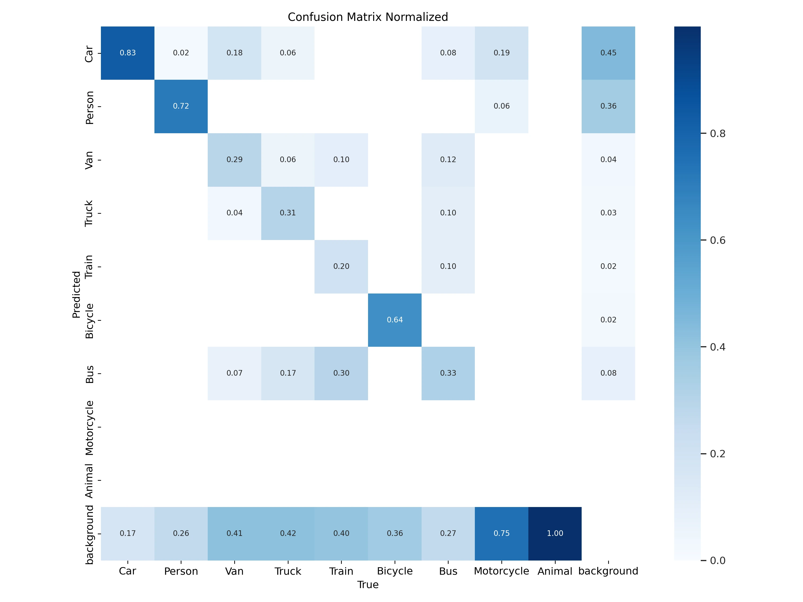

# YOLOv8 Object Detection

<!-- TOC -->

- [YOLOv8 Object Detection](#yolov8-object-detection)
  - [Object Detection with the Coco8 Dataset](#object-detection-with-the-coco8-dataset)
  - [Object Detection with Custom Datasets](#object-detection-with-custom-datasets)
  - [Model Training (N-Model)](#model-training-n-model)
    - [Training Results](#training-results)
    - [Re-run Model Training with the S-Model](#re-run-model-training-with-the-s-model)
    - [Evaluation](#evaluation)

<!-- /TOC -->

## Object Detection with the Coco8 Dataset

Let's start by using the officially provided mini version of the COCO Dataset [coco8](https://github.com/ultralytics/ultralytics/blob/main/ultralytics/cfg/datasets/coco8.yaml). [Download the dataset](https://ultralytics.com/assets/coco8.zip) and unpack into the root dir of your project:


```bash
root
├── coco8.yaml
├── datasets
├── coco8
│   ├── images
│   │   ├── train
│   │   │   ├── 000000000009.jpg
│   │   │   ├── 000000000025.jpg
│   │   │   ├── 000000000030.jpg
│   │   │   └── 000000000034.jpg
│   │   └── val
│   │       ├── 000000000036.jpg
│   │       ├── 000000000042.jpg
│   │       ├── 000000000049.jpg
│   │       └── 000000000061.jpg
│   └── labels
│       ├── train
│       │   ├── 000000000009.txt
│       │   ├── 000000000025.txt
│       │   ├── 000000000030.txt
│       │   └── 000000000034.txt
│       ├── train.cache
│       ├── val
│       │   ├── 000000000036.txt
│       │   ├── 000000000042.txt
│       │   ├── 000000000049.txt
│       │   └── 000000000061.txt
│       └── val.cache
└── train.py
```

As seen above place the [coco8.yaml](https://github.com/ultralytics/ultralytics/blob/main/ultralytics/cfg/datasets/coco8.yaml) in the root dir next to a python script file `train.py`:


_./train.py_

```py
from ultralytics import YOLO

dataset = 'coco8.yaml'

# Load a model
model = YOLO("yolov8n.yaml")  # build a new model from scratch
# model = YOLO("yolov8n.pt")  # load a pre-trained model (recommended for training)

# Use the model
model.train(data=dataset, epochs=1)  # train the model
```

__Make sure:__

* That every `jpg` file in your training dataset has a corresponding annotations `txt` file in the corresponding folder `images/train` -> `labels/train` etc.
* Don't add any additional text files, e.g. `classes.txt` generated by `labelImg`, see below.
* For every image file that does not contain any classes you must add an empty label file with the correct name.
* You probably ([Github issue](https://github.com/ultralytics/ultralytics/issues/1201)) have to define the root path in `coco8.yaml` absolute. The images path has to be relative to the root dir.


_./coco8.yaml_

```yml
path: /absolute/path/to/root/dir/datasets/coco8  # dataset root dir
train: images/train  # train images (relative to 'path') 4 images
val: images/val  # val images (relative to 'path') 4 images
test:  # test images (optional)

# Classes
names:
  0: person
  ...
```

Obviously, after only 1 epoch and with so little images the results are abysmal - but this is just a proof that the environment is set up correctly and we are ready to go:

|  |  |  |  |  |  |  |
| -- | -- | -- | -- | -- | -- | -- |
| Class | Images | Instances | Box(P | R  | mAP50 | mAP50-95) |
| all   |    4   |    17     |   0   |  0 |   0   |       0   |

* _Speed: 1.0ms preprocess, 149.6ms inference, 0.0ms loss, 0.2ms postprocess per image_
* _Results saved to runs/detect/train_

Check out the folder `./runs/detect/train` for more fascinating insights into the training run.


## Object Detection with Custom Datasets

Obviously, if we wanted to train YOLO on the COCO dataset we could just download the pre-trained weights and be done. The interesting part is now to be able to use our own datasets.


For unlabelled data you can use tools like [labelImg](https://github.com/HumanSignal/labelImg) to generate [YOLO](https://github.com/ultralytics/ultralytics) compatible annotations for your image dataset:


I am going to use the [CitiScapes Dataset](https://www.kaggle.com/datasets/zhangyunsheng/cityscapes-data) that you can download from Kaggle.


Annotating the Dataset (make sure the output is set to __YOLO__) generates a dictionary of all the classes you used, e.g.:


_classes.txt_:

```bash
Car
Person
Van
Truck
Train
Bicycle
Bus
Motorcycle
Animal
```

And a text file for every annotated image that defines the bounding boxes you drew and assigns the selected class to as a list index for the classes dictionary above - e.g. the image `499.jpg` now has a `499.txt` file showing two bounding boxes with `classes[0] = Car`:


_499.txt_:

```bash
0 0.148438 0.558594 0.179688 0.210938
0 0.583984 0.515625 0.042969 0.140625
```

* `0`: means that the bbox belongs to the first class in `classes.txt` which is `Car`
* `0.148438`: x-value for the center of the bounding box
* `0.558594`: y-value for the center of the bounding box
* `0.179688`: width for the bounding box
* `0.210938`: height for the bounding box


Copy all images into a folder called `datasets/Citiscapes/images/train` and all text files into at folder called `datasets/Citiscapes/labels/train` to proceed.


## Model Training (N-Model)

To train the YOLO model I now want to take the [COCO pre-trained YOLOv8 model](https://docs.ultralytics.com/usage/python/) as a starter and feed it my annotated dataset for training:


_./train.py_

```py
from ultralytics import YOLO

# Load a model
# model = YOLO("yolov8n.yaml")  # build a new model from scratch
model = YOLO("yolov8n.pt")  # load a pre-trained model (recommended for training)

# Use the model
model.train(data="citiscapes.yaml", epochs=10)  # train the model
# metrics = model.val()  # evaluate model performance on the validation set
# results = model("https://ultralytics.com/images/bus.jpg")  # predict on an image
# model.export(format='onnx', dynamic=True)  # export the model to ONNX format
# model.export(format='onnx', device=0)  # export the model to TensorRT format
```

The `citiscapes.yaml` points YOLO to the dataset:

```yml
path: /absolute/path/to/root/dir/datasets/Citiscapes # root dir
train: images/train # rel path to training images
val: images/train # rel path to validation images ~ i don't have any, yet

names:
    0: Car
    1: Person
    2: Van
    3: Truck
    4: Train
    5: Bicycle
    6: Bus
    7: Motorcycle
    8: Animal
```

__Training Results__:

Model summary (fused): 168 layers, 3007403 parameters, 0 gradients:

|  |  |  |  |  |  |  |
| -- | -- | -- | -- | -- | -- | -- |
| Class | Images | Instances | Box(P | R | mAP50 | mAP50-95) |
| all | 500 | 2579 | 0.699 | 0.423 | 0.463 | 0.304 |
| Car | 500 | 1595 | 0.851 | 0.809 | 0.893 | 0.592 |
| Person | 500 | 694 | 0.754 | 0.703 | 0.778 | 0.439 |
| Van | 500 | 82 | 0.641 | 0.354 | 0.43 | 0.329 |
| Truck | 500 | 36 | 0.578 | 0.472 | 0.554 | 0.417 |
| Train | 500 | 10 | 0.217 | 0.3 | 0.252 | 0.127 |
| Bicycle | 500 | 96 | 0.816 | 0.604 | 0.744 | 0.454 |
| Bus | 500 | 49 | 0.429 | 0.568 | 0.474 | 0.356 |
| Motorcycle | 500 | 16 | 1 | 0 | 0.0398 | 0.0212 |
| Animal | 500 | 1 | 1 | 0 | 0 | 0 |

* _Speed: 0.6ms preprocess, 36.0ms inference, 0.0ms loss, 1.2ms postprocess per image_
* _Results saved to runs/detect/train2_


### Training Results


__Original Image Labels__


__Predicted Image Labels__


__Confusion Matrix__




### Re-run Model Training with the S-Model


|  |  |  |  |  |  |  |
| -- | -- | -- | -- | -- | -- | -- |
| Class | Images | Instances | Box(P | R | mAP50 | mAP50-95) |
| all | 500| 2579| 0.775| 0.54| 0.767| 0.52 |
| Car | 500| 1595| 0.82| 0.902| 0.929| 0.635 |
| Person | 500| 694| 0.86| 0.713| 0.84| 0.495 |
| Van | 500| 82| 0.62| 0.646| 0.72| 0.528 |
| Truck | 500| 36| 0.84| 0.438| 0.632| 0.507 |
| Train | 500| 10| 0.541 | 0.3| 0.46| 0.338 |
| Bicycle | 500 |  96| 0.845| 0.74| 0.824| 0.51 |
| Bus | 500 |  49| 0.599| 0.776| 0.779| 0.583 |
| Motorcycle | 500 |  16| 0.847| 0.349| 0.722| 0.49 |
| Animal | 500 |   1 |   1 | 0| 0.995| 0.597 |

* _Speed: 0.6ms preprocess, 71.4ms inference, 0.0ms loss, 0.3ms postprocess per image_
* _Results saved to runs/detect/train4_


### Evaluation

Run `prediction.py` with the best training weights on an unknown video source similar to the training material.


__Predictions on Unknown Videos__


__Confusion Matrix__


<!-- 
You can download a annotated set of images from the [Open Images Dataset](https://storage.googleapis.com/openimages/web/visualizer/index.html) using the [OIDv4_ToolKit](https://github.com/EscVM/OIDv4_ToolKit):


```bash
git clone https://github.com/EscVM/OIDv4_ToolKit.git
cd OIDv4_ToolKit
pip install -r requirements.txt
```


```bash
python main.py -h

usage: main.py [-h] [--Dataset /path/to/OID/csv/] [-y] [--classes list of classes [list of classes ...]]
               [--type_csv 'train' or 'validation' or 'test' or 'all'] [--sub Subset of human verified images or machine generated (h or m)]
               [--image_IsOccluded 1 or 0] [--image_IsTruncated 1 or 0] [--image_IsGroupOf 1 or 0] [--image_IsDepiction 1 or 0]
               [--image_IsInside 1 or 0] [--multiclasses 0 (default) or 1] [--n_threads [default 20]] [--noLabels] [--limit integer number]
```


```bash
python main.py downloader --classes classes.txt --type_csv all --multiclasses 1 --limit 1000
```

For this to work you need to add a file `classes.txt` to the root directory of the repository and run the command from there. The text file simply lists all classes you are interested in - one per line. Class labels that contain multiple words have to be separated by an underscore instead of a space, e.g. `Polar_Bear`.


I am interested in a multi-class object detector. By setting the flag `--multiclasses 1` I will end up with a multiclass dataset (all files will be put inside one folder). And the combination of `--type_csv all` and `--limit 1000` will give me a train-test-validation split with ~3 x 1000 images for each class. I have chosen the following classes:


_classes.txt_

```bash
Vehicle
Person
Animal
```

All the images downloaded already come with label annotations - so we are ready to go. The labels will be saves as text files in the `Label` sub directory:

```bash
tree -L 3 OID/Dataset

OID/Dataset
├── test
│   └── Vehicle_Person_Animal
│       ├── fd9d2a6a27174cd2.jpg
│       ├── fea234629eea3827.jpg
│       ├── ...
│       └── Label
│           ├── fd9d2a6a27174cd2.txt
│           ├── fea234629eea3827.txt
│           └── ...
├── train
│   └── Vehicle_Person_Animal
│       ├── f0e1f28fddf194bf.jpg
│       ├── ec54c40892d901ad.jpg
│       ├── ...
│       └── Label
│           ├── f0e1f28fddf194bf.txt
│           ├── ec54c40892d901ad.txt
│           └── ...
└── validation
    └── Vehicle_Person_Animal
        ├── ffd7361abccd432c.jpg
        ├── fff2268a1b921e8e.jpg
        ├── ...
        └── Label
            ├── ffd7361abccd432c.txt
            ├── fff2268a1b921e8e.txt
            └── ...


10 directories, 7798 files
```

with a label file listing all the found object inside the image of the same name and it's bounding-box annotations, e.g. :

_57d7181f655a897e.txt_

```bash
Vehicle 424.047616 323.18557500000003 999.728128 432.119016
Person 0.0 303.591162 19.533824 337.274784
Person 18.354176 301.818519 40.779776 339.04810799999996
Person 41.960448 300.04587599999996 64.976896 337.86589200000003
Person 71.469056 297.091017 94.48448 335.502141
Person 100.386816 292.363515 145.23904 331.956855
Person 227.861504 225.58737900000003 390.156288 291.772407
Person 447.401984 320.72852700000004 978.548736 415.279248
Person 962.614272 232.087524 975.007744 266.953362
Person 970.876928 231.497097 984.450048 266.953362
```

_57d7181f655a897e.jpg_


__Update__: The downloader converts the bbox loc to absolute pixels and uses classnames for the image labels. I [updated the repository](https://github.com/mpolinowski/OIDv4_ToolKit) to keep the normalized loc's and use 1-hot encoded class labels when using the flag `--noConversion`. You have to add the `classes.txt` file to every `Label` folder and you are now able to use [labelImg](https://github.com/HumanSignal/labelImg) to visualize the bboxes:


```bash
python main.py downloader --classes classes.txt --type_csv train --multiclasses 1 --limit 1000 --noConversion
```

### Open Image Dataset

* [Open Images (V7 - released Oct 2022)](https://storage.googleapis.com/openimages/web/download_v7.html)


```bash
docker pull python:buster
```

```bash
docker run -ti --rm -p 5151:5151 \
-v $(pwd):/root/fiftyone \
python:buster /bin/bash
```


```bash
pip install fiftyone
```

For unlabelled data you can use tools like [labelImg](https://github.com/HumanSignal/labelImg) to generate YOLO compatible annotations for your image dataset:


```bash
#
# Load 50 random samples from the validation split
#
# Only the required images will be downloaded (if necessary).
# By default, all label types are loaded
#

fiftyone zoo datasets load open-images-v7 \
    --split validation \
    --kwargs \
        max_samples=50

fiftyone app launch open-images-v7-validation-50

#
# Load detections, classifications and points for 25 samples from the
# validation split that contain fedoras and pianos
#
# Images that contain all `label_types` and `classes` will be
# prioritized first, followed by images that contain at least one of
# the required `classes`. If there are not enough images matching
# `classes` in the split to meet `max_samples`, only the available
# images will be loaded.
#
# Images will only be downloaded if necessary
#

# Supported types are ['classifications', 'detections', 'points', 'relationships', 'segmentations']

fiftyone zoo datasets load open-images-v7 \
    --split validation \
    --kwargs \
        label_types=segmentations,classifications \
        classes=Person,Car,Bus,Truck,Animal \
        max_samples=25

fiftyone app launch open-images-v7-validation-25

#
# Download the entire validation split and load detections
#
# Subsequent partial loads of the validation split will never require
# downloading any images
#

fiftyone zoo datasets load open-images-v7 \
    --split validation

fiftyone app launch open-images-v7-validation
```
-->